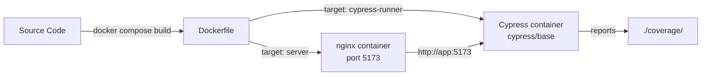

# Company Gestion UI

React Admin v5 dashboard for company management (finance, inventory, HR).

## Stack

- **React 19** + **React Admin v5**
- **MUI v7** (Material UI)
- **Vite 7** (build tool)
- **Cypress 15** (E2E tests with coverage)
- **TypeScript**

## Installation

```sh
npm install
```

## Development

```sh
npm run dev
```

The Vite dev server proxies API calls to the backend (see `vite.config.ts`).

### Dev environment variables

| Fichier | Usage | Commit ? |
|---------|-------|----------|
| `.env` | Config partagée (tout le monde) | ✅ Oui |
| `.env.local` | Surcharge personnelle | ❌ Non (`.gitignore`) |

**`.env`** (commité, partagé) :
```
VITE_SIMPLE_REST_URL=http://localhost:8080
```

**`.env.local`** (personnel, à créer) :
```
VITE_API_URL=http://localhost:8080
```

> `VITE_API_URL` est utilisée dans le code source (`import.meta.env.VITE_API_URL ?? ''`). Si absente, les requêtes API sont relatives et passent par le proxy Vite.

---

## Tests E2E

Tests avec Cypress + Istanbul pour la couverture de code.

### Prérequis

Aucun serveur de dev nécessaire — les tests buildent l'app, la servent statiquement, puis exécutent Cypress.

### Local (sans Docker)

```sh
npm run cypress:coverage
```

### Docker

```sh
npm run cypress:docker       # Build + tests dans des containers
npm run cypress:docker:ci    # Avec vidéo activée
```

### Single spec

```sh
npx cypress run --config-file src/__tests__/cypress.config.ts --spec "src/__tests__/e2e/auth.cy.ts"
```

### Interactive

```sh
npx cypress open --config-file src/__tests__/cypress.config.ts
```

### Test environment variables

| Fichier | Usage | Commit ? |
|---------|-------|----------|
| `.env.test` | Config test partagée | ✅ Oui |
| `.env.ci` | Surcharge CI locale | ❌ Non (`.gitignore`) |
| `docker-compose.yml` | Vars pour le conteneur Cypress | ✅ Oui |
| `.github/workflows/ci.yml` | Vars pour GitHub Actions | ✅ Oui |

**`.env.test`** — lu automatiquement par `scripts/run-cypress-coverage.sh` :
```
VITE_API_URL=
CYPRESS_BASE_URL=http://localhost:5174
CYPRESS_VIDEO=false
CYPRESS_DEFAULT_COMMAND_TIMEOUT=10000
CYPRESS_VIEWPORT_WIDTH=1280
CYPRESS_VIEWPORT_HEIGHT=720
NYC_CAFEOBJECT_COVERAGE=true
TEST_APP_PORT=5174
```

> Le port 5174 est dédié aux tests. Il ne conflit jamais avec `npm run dev` (5173).

---

## Docker



- **Deux containers**: `app` (nginx) + `cypress` (test runner)
- **Isolation réseau**: Cypress joint l'app via `http://app:5173`
- **Port hôte**: mappé sur 5174 par défaut (`TEST_APP_PORT=5174`)
- **Couverture**: écrite dans `./coverage/` via bind mount

### Fichiers

| Fichier | Rôle |
|---------|------|
| `Dockerfile` | Multi-stage : build → server (nginx) → cypress-runner |
| `docker-compose.yml` | Orchestration des deux services |
| `nginx.conf` | Configuration nginx SPA (port 5173) |
| `.dockerignore` | Exclut node_modules, dist, .git |

---

## Environment Variables — Reference

### Où placer chaque variable

| Variable | `.env` | `.env.local` | `.env.test` | `.env.ci` | `docker-compose` | `github-ci` |
|----------|--------|-------------|-------------|-----------|-----------------|-------------|
| `VITE_SIMPLE_REST_URL` | ✅ | | | | | |
| `VITE_API_URL` | | ✅ | ✅ | ✅ | ✅ | |
| `CYPRESS_BASE_URL` | | | ✅ | ✅ | ✅ | |
| `CYPRESS_VIDEO` | | | ✅ | ✅ | | ✅ |
| `CYPRESS_DEFAULT_COMMAND_TIMEOUT` | | | ✅ | | | |
| `CYPRESS_VIEWPORT_WIDTH` | | | ✅ | | | |
| `CYPRESS_VIEWPORT_HEIGHT` | | | ✅ | | | |
| `NYC_CAFEOBJECT_COVERAGE` | | | ✅ | ✅ | ✅ | ✅ |
| `TEST_APP_PORT` | | | | | (port mapping) | |

### Descriptions

| Variable | Default | Où | Description |
|----------|---------|-----|-------------|
| `VITE_SIMPLE_REST_URL` | — | App (non utilisé) | URL de l'API REST (legacy) |
| `VITE_API_URL` | `''` | App source | URL du backend API (vide = mocké ou proxy) |
| `CYPRESS_BASE_URL` | `http://localhost:5174` | `cypress.config.ts` | URL de l'app sous test |
| `CYPRESS_VIDEO` | `false` | `cypress.config.ts` | Enregistrement vidéo des tests |
| `CYPRESS_DEFAULT_COMMAND_TIMEOUT` | `10000` | `cypress.config.ts` | Timeout par défaut (ms) |
| `CYPRESS_VIEWPORT_WIDTH` | `1280` | `cypress.config.ts` | Largeur viewport |
| `CYPRESS_VIEWPORT_HEIGHT` | `720` | `cypress.config.ts` | Hauteur viewport |
| `NYC_CAFEOBJECT_COVERAGE` | `true` | `vite.config.ts` | Active l'instrumentation Istanbul |
| `TEST_APP_PORT` | `5174` | `scripts/run-cypress-coverage.sh` | Port du serveur statique (dédié tests) |

### Sécurité

- `VITE_API_URL` reste **vide** dans les tests → toutes les requêtes sont interceptées par `cy.intercept()`
- `src/__tests__/support/e2e.ts` contient un intercepteur global qui log les fuites potentielles vers un vrai backend
- En Docker, l'isolation réseau empêche toute connexion意外e à un backend réel

---

## CI/CD

GitHub Actions (`.github/workflows/ci.yml`) :

1. **`lint-and-typecheck`** : ESLint + TypeScript check
2. **`cypress-with-coverage`** : Build Docker + E2E tests + coverage (seuil 60%)

```sh
# Simuler CI localement
npm run cypress:docker:ci
```

---

## Architecture

```
src/
├── auth/          # Auth provider, login, register
├── config/        # Dynamic resources, API config
├── core/          # App, Layout, Menu, AppBar
├── features/      # Pages métier (money, storage, transversal)
├── generic/       # Composants réutilisables
├── gen-ts/        # Client API généré (OpenAPI)
├── style/         # Thème MUI, design tokens
├── utili/         # Utilitaires
└── __tests__/     # Tests E2E + mocks
```

## Scripts utiles

| Commande | Description |
|----------|-------------|
| `npm run dev` | Serveur de dev (port 5173) |
| `npm run build` | Build production |
| `npm run lint` | ESLint avec auto-fix |
| `npm run type-check` | TypeScript check |
| `npm run cypress:coverage` | Tests E2E + couverture |
| `npm run cypress:docker` | Tests E2E dans Docker |
| `npm run cypress:docker:ci` | Tests Docker avec vidéo |
| `npm run gen:api` | Générer client API depuis `api.yml` |
